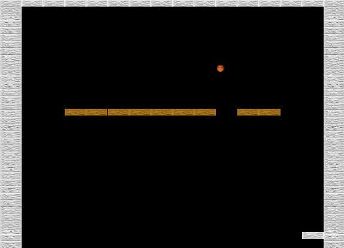
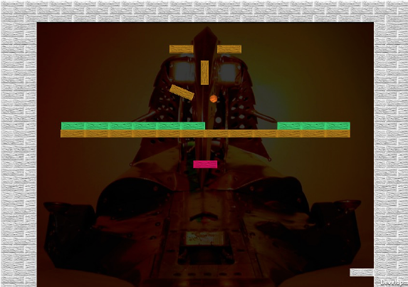

# Block Breaker

This is a recreation of classic block breaking games like Arkanoid. A bat at the bottom of the screen is used to bounce a ball towards the blocks above. These blocks disappeaer after one or more hits, depending on the type of block. 

There is background music, and sound effects for the ball bouncing and for the blocks breaking. Once all destructible blocks in the level are gone, the player can move onto the next level without interruption of the music. 

